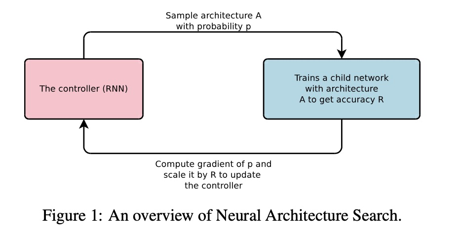
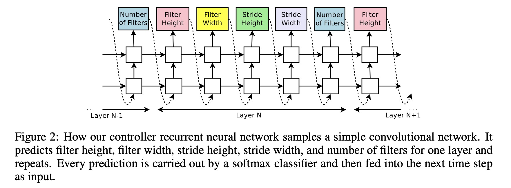
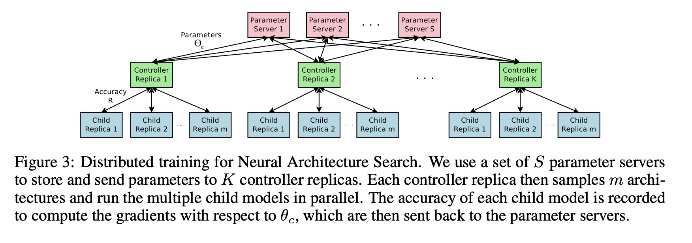
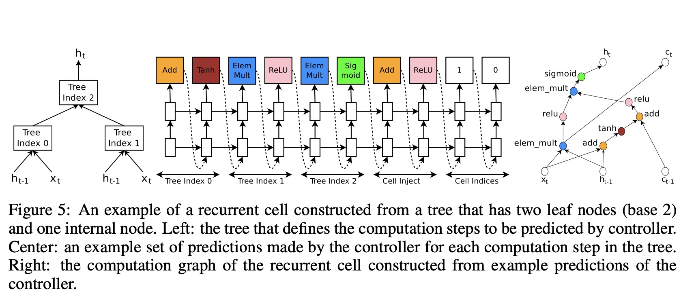
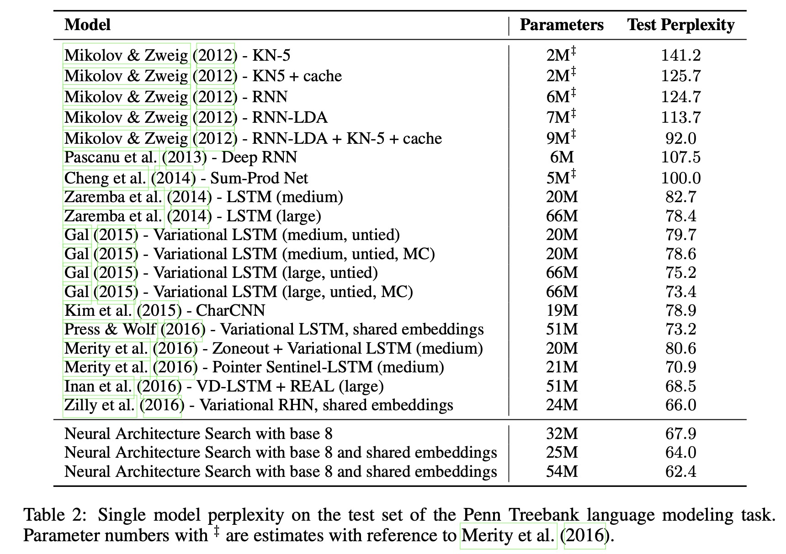

Neural architecture search with reinforcement learning

# 1. Motivation

随着深度学习大行其道，特征工程上精力可能需要花费的少一点了（尤其是在cv领域，深度学习取代了一部分特征工程工作），但是神经网络的架构设计及验证可能需要耗费更多的精力与资源。

因此，神经网络的架构搜索（Neural Architechture Search）工作成为了一个有价值的热门工作。

在2017年，Google Brain的Barret Zoph与Quoc V. Le[1]提出了基于强化学习的NAS。

这是本文提出的NAS-RL架构的示意图，（以生成CNN网络为例），用RNN来控制生成网络的架构（网络架构的超参包括每一个CNN的filter的个数，fitler的height、width，stride的height、width等）。与基于[元学习](https://www.jianshu.com/p/b59b32520b50)来学习优化器的迭代规则类似，同样也是使用了RNN。

不同的是，网络架构生成这里，不便使用梯度下降策略，不便直接使用当前数据的loss来评价；怎么评价一个网络结构好与不好，需要看在验证集上的效果。因此，论文使用强化学习，以验证集上的accuracy指标为reward。

# 2. NAS RL

## 2.1 RNN

如图所示，这是一个RNN控制器。用RNN生成每一层的相关超参。

## 2.2 RL

RNN的输出当做强化学习的action $a_{1:T}$，验证集上的accuracy是reward $R$，

控制器需要最大化期望reward，

$J(\theta_c) = E_{P(a_{1:T}; \theta_c)}[R]$

因为$R$是不可导的，作者采用policy gradient来迭代更新$\theta_c$；本文中使用的是REINFORCE方法[2]。

$\nabla_{\theta_c} J(\theta_c) = \sum_{t=1}^T E_{P(a_{1:T; \theta_c})}[\nabla_{\theta_c} log P(a_t|a_{(t-1):1}; \theta_c)R]$

上述公式的一个emprical approximation是，

$\frac{1}{m} \sum_{k=1}^m \sum_{t=1}^T \nabla_{\theta_c} log P(a_t|a_{(t-1):1}; \theta_c)R_k$

这个近似计算是无偏（unbias）的，但是有较大的方差(variance)；作者采用了一个无偏且降低方差的方式，加入一个与当前action无关的baseline function $b$。

$\frac{1}{m} \sum_{k=1}^m \sum_{t=1}^T \nabla_{\theta_c} log P(a_t|a_{(t-1):1}; \theta_c)(R_k - b)$

$b$选择了之前架构的accuracy的指数滑动平均（exponential moving avergage)。

## 2.3 PS

为了加速计算，作者采用Parameter server，从而可以并行、异步更新。

## 2.4 Generate RNN Cell

使用RNN预测超参是最直接的生成CNN网络的方式，作者设计了一个生成RNN网络的方式。

作者指出，RNN、LSTM的生成步骤可以视为一个树（step），以$x_t$与$h_{t-1}$为输入，得到$h_t$。

RNN控制器给树的每一个节点预测相应的操作（比如二元操作Add + 激活函数Tanh）。

# 3. Experiment

作者在实验中表示，使用了800个GPU，从而任意时刻可以同时预测800个网络模型结构；真是财大气粗。

基于RL的NAS，在每一次搜索过程中已经很好地利用了过往的结构的效果；但是由于整体上的搜索空间还是太大，这个工作本身还是非常消耗资源的。

# 4. Preferences

[1] Zoph, Barret, and Quoc V. Le. "Neural architecture search with reinforcement learning." arXiv preprint arXiv:1611.01578 (2016).

[2] Ronald J. Williams. Simple statistical gradient-following algorithms for connectionist reinforcement learning. In Machine Learning, 1992.