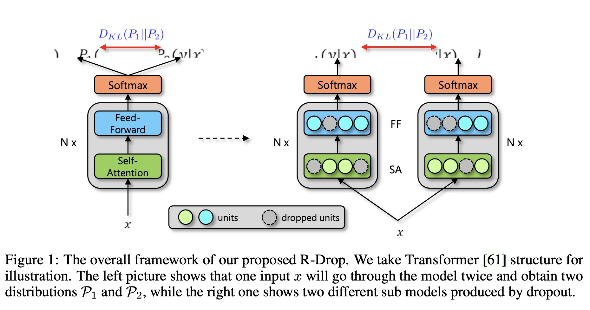
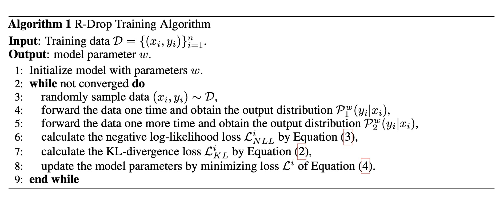
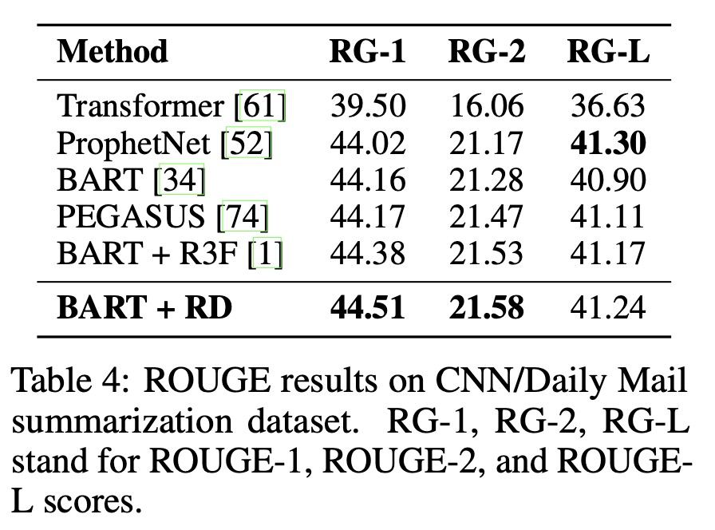

R-Drop: Regularized Dropout for Neural Networks

# 1. Motivation

想法很直接，对模型做两次Dropout得到两个不同的子模型，相同的样本，让两个子模型的预测尽可能相近。

自监督学习往往需要一些对比样本，对模型做两次Dropout，让模型自监督，样本与正常的有监督一样，不需要额外处理。

从论文的related work中感觉，想法可能来自于自知识蒸馏（self knowledge distilling）。

# 2. R-Drop

对于样本$(x_i, y_i)$，分别经过两次dropout过的模型，得到预测结果$P_1^w(y_i|x_i)$与$P_2^w(y_i|x_i)$。

损失函数由两个预测结果的负log似然与两个预测结果之间的KL散度组成。

$L_{KL}^i = \frac{1}{2}(D_{KL}(P_1^w(y_i|x_i)||P_2^w(y_i|x_i)) + D_{KL}(P_2^w(y_i|x_i)||P_1^w(y_i|x_i)))$

$L^i_{NLL} = -\log P_1^w(y_i|x_i) - \log P_2^w(y_i|x_i)$

总的loss由上面两个loss加权得到，

$L^i = L^i_{NLL} + \alpha L^i_{KL}$

# 3. Experiment

实验中选择的dropout rate一般在（0.3, 0.3）左右，$\alpha$一般是5，具体任务具体分析。

优点：
（1）将自监督学习，从常用的横向扩展对比样本（正样本+$K$个负样本或者样本增强），变成模型增强（变成两个子模型），样本处理逻辑不变，从而打开了自监督、自蒸馏学习的思路；或许更适配更多场景。

思考：
（1）因为模型需要两次前向，整个训练时间是否加倍了？(论文实验采用相同输入复制两遍，相当于增大了batch_size)
（2）那从模型增强（笔者如此称呼）角度看，除了dropout，有没有别的方法了？
 (3) 预测用哪个模型，没有dropout的版本吗？

# 4. Preferences

[1] Liang, Xiaobo, et al. "R-Drop: Regularized Dropout for Neural Networks." arXiv preprint arXiv:2106.14448 (2021).
