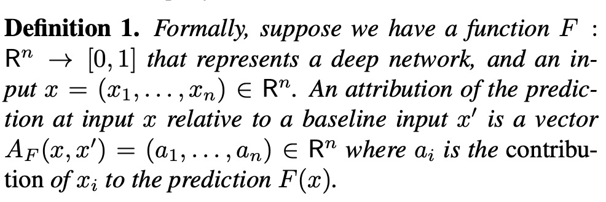
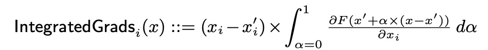
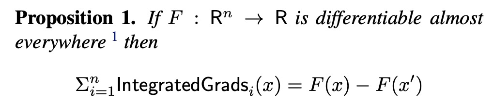
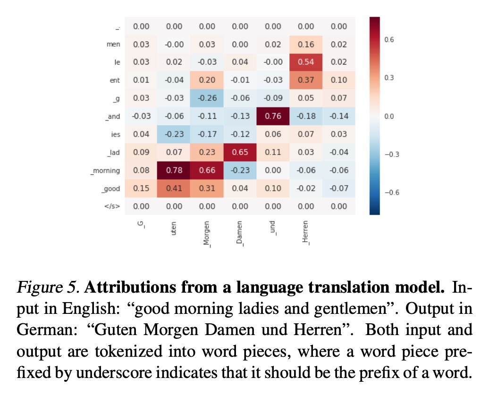

Axiomatic attribution for deep networks

# 1. Motivation

本文讨论的问题是：如何将深度学习网络归因到输入特征上（另一方面，体现了输入特征的重要性）。

作者认为，归因方法需要具备两个条件：
(1) Sensitivity: 敏感性
(2) Implementation Invariance：实现不变性

# 2. Integrated Gradient

## 2.1 Attribute

作者定义$A_F(x, x')$是**模型**$F$对**输入**$x$相对baseline$x'$的归因。

也就是归因涉及到的元素：模型、输入特征、输入特征的baseline。

## 2.2 Axiom: Sensitivity(a)

对于任意的输入与其baseline，如果输入与baseline只有一个特征不一样，并且有不同的预测结果，那么这个不一样的特征应该被归因模型赋予一个**非零**的归因值。

符合一般直觉的直接使用预测值对输入的梯度来归因的方法，不满足这个公理：因为模型有可能陷入梯度平滑区域，不同的输入，梯度是相同的。这也是为什么本文使用积分梯度。

## 2.3 Axiom: Implementation Invariance

如果两个不同实现的模型，对于任意的输入，都得到相同的输出，那么这两个模型是等价的，归因模型应该给予输入相同的归因值。

作者指出，LRP与DeepLift等模型，提出的离散梯度方法修改了反向传播形式，但是并不满足链式法则，从而破坏了对归因结果应该对模型实现不变这个公理。

## 2.4 Axiom: Completeness

归因值的总和，应该等于当前输入特征的预测值与baseline的预测值之差。

## 2.5 Integrated Gradient

本文提出积分梯度方法，对于维度$i$，沿着一个路径，从某个baseline对梯度进行积分。

积分梯度满足Completeness公理。

Baseline一般选择让模型输出约等于为0的值。

# 3. Experiment

优点：
（1）积分梯度是一个很好的，从理论与实际角度思考，基于**梯度**这个深度学习中最重要的武器，得到的归因方法。

思考：
（1）方法对于积分的起点与路径是敏感，在特定场景有没有更好的启发式的选择？

# 4. Preferences

[1] Sundararajan, Mukund, Ankur Taly, and Qiqi Yan. "Axiomatic attribution for deep networks." International Conference on Machine Learning. PMLR, 2017.