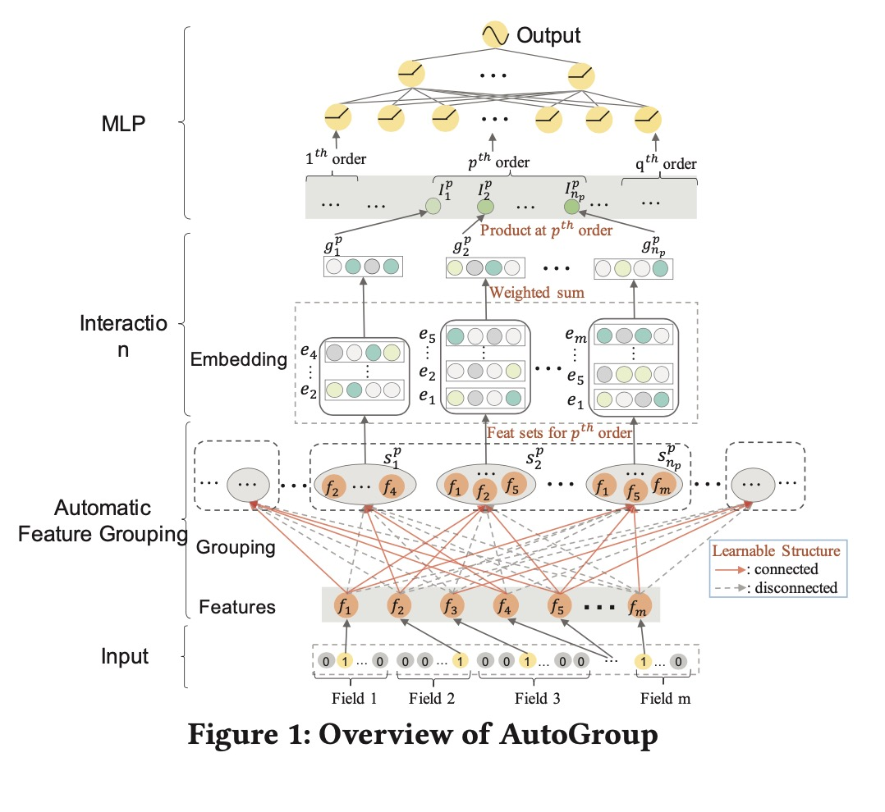
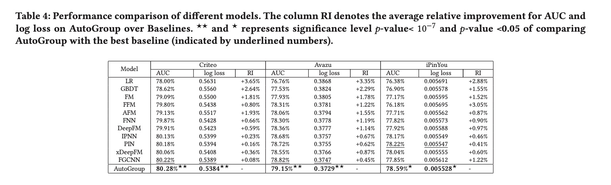

AutoGroup: Automatic Feature Grouping for Modelling Explicit High-Order Feature Interactions in CTR Prediction

# 1. Motivation

在CTR预估中，特征交叉是关键。目前大部分的特征交叉工作集中在以FM为代表的二阶交叉；高阶交叉以DeepCross、xDeepFM等为代表。已有的高阶交叉本质上还是暴力交叉，往往会引入噪声，甚至带来模型效果的下降。

本文提出基于AutoML来寻找高阶特征交叉，将问题建模为结构优化（struture optimization）。

并且在华为线上系统取得了收益。

# 2. AutoGroup

## 2.1 Automatic Feature Grouping

对于$m$个field，第$i$个field的feature是$f_i$，为代表$p$阶交叉，选择$n_p$个特征集合$s_j^p, 1 \le j \le n_p$。

用${\prod_{i,j}}^p$表示特征$f_i$是否在p阶交叉里被选择到特征集$s_j^p$里。

优化目标是：

$min_{\prod, \theta}L_{train}(Y, F(\prod^1, ..., \prod^p, ..., \prod^q, X, \theta))$

$q$是最大的交叉阶数。

这是一个结构优化（Struture optimization）问题，每个特征可以被每一个group选中。

借鉴DARTS[2]的做法，将离散问题连续化。

${\prod_{i,j}}^p \in \{0, 1\}$, 

${\prod_{i,j}'}^p = \frac{1}{1+ exp(-\alpha_{i,j}^p)} {\prod_{i,j}}^p + \frac{exp(-\alpha_{i,j}^p)}{1+exp(-\alpha_{i,j}^p)}(1-{\prod_{i,j}}^p)$

$\alpha=\{\alpha_{i,j}^p\}$被称为结构参数（structure parameter）。

基于NAS领域的发展，使用Gumbel-Softmax trick。将不可导的从categorical分布采样从可导的Gumbel-Softmax分布上。

${\prod_{i,j}'}^p = \arg\max_{o \in \{0, 1\}}(log \alpha_o + G)$, 

$\alpha_1 = \frac{1}{1 + exp(-\alpha_{i,j}^p)}$, $\alpha_0 = 1 - \alpha_1$。

$G$是一个服从标准Gumbel分布的随机边变量，$G = -log(-log u)$, $u \sim U(0, 1)$。

将不可导的$\arg\max$改成softmax，

$({\prod_{i,j}'}^p)_o = \frac{exp((log \alpha_0 + G_0) / \tau)} { \sum_{i \in \{0, 1\}} exp((log \alpha_i + G_i / \tau)}$

$\tau$是temperature。

初始化的时候，$({\prod_{i,j}'}^p)_0 = ({\prod_{i,j}'}^p)_1$，训练过程中，如果$p$阶交叉有益，则更新选择概率。

测试过程中，不再使用Gumbel-softmax，而是看如果$\alpha_1$大于$\alpha_0$，则把相应的特征加入$p$阶交叉中去。

## 2.2 Interaction Stage

### 2.2.1 Feature set representation

特征集合$s_j^p$的表示为，

$g_j^p = \sum_{f_i \in s_j^p} w_i^p e_i$

### 2.2.2 Feature interaction at a given order

借鉴FM的推导形式，$p$阶交叉表示为，

$(\sum_{i=1}^n x_i e_i)^p - \sum_{i=1}^n (x_i e_i)^p$

**这个想法很妙**，作者认为，这其中虽然包括了一些比如$(f_i)^2f_j$这样的形式，可以理解成3阶交叉并对其中一个特征求偏导；加入这样的特征还是比较新奇的。

## 2.3 MLP Stage

这部分比较正常，concat之前所有的高阶特征交叉的表示，然后接入MLP。

# 3. Experiment

作者表示，在华为线上系统里AB test，相比DeepFM有提升。

# 4. Preferences
[1] Liu, Bin, et al. "AutoGroup: Automatic feature grouping for modelling explicit high-order feature interactions in CTR prediction." Proceedings of the 43rd International ACM SIGIR Conference on Research and Development in Information Retrieval. 2020.

[2] Hanxiao Liu, Karen Simonyan, and Yiming Yang. 2018. Darts: Differentiable architecture search. arXiv preprint arXiv:1806.09055 (2018).

[3] Eric Jang, Shixiang Gu, and Ben Poole. 2016. Categorical reparameterization with gumbel-softmax. arXiv preprint arXiv:1611.01144 (2016).