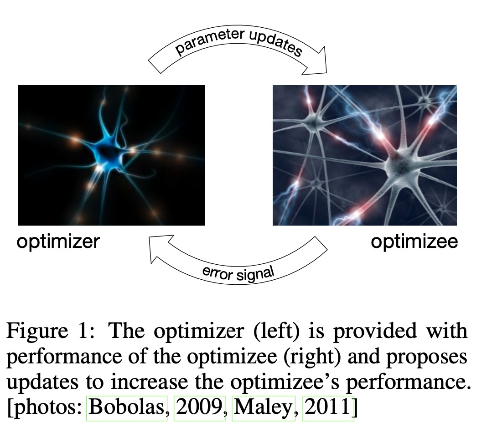
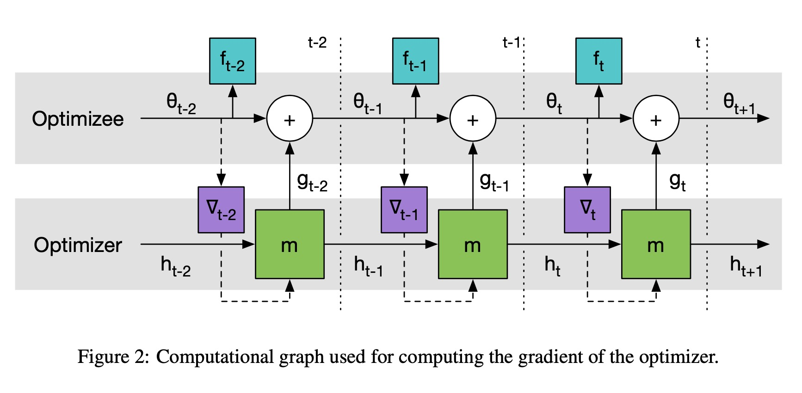
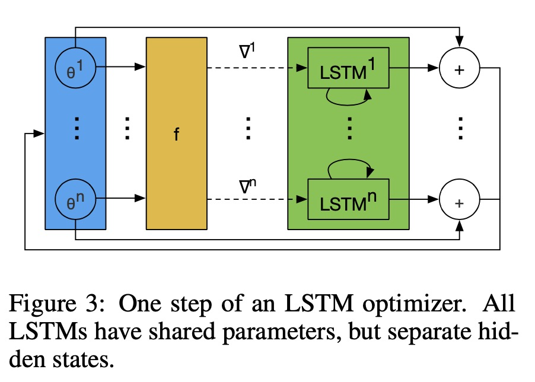
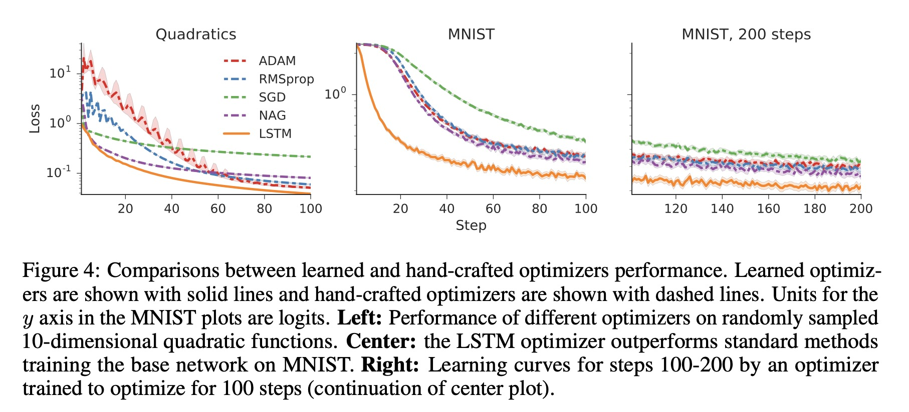

Learning to learn by gradient descent by gradient descent

# 1. Motivation

Google DeepMind等[1]发表在NIPS2016年的论文，立意非常高。

在深度学习中，有五花八门的人工设计的优化器，比如传统的SGD，以及后来的Momentum、AdaGrad、RMSProp以及大多数情况下的首选优化器Adam等。

不同的优化器，深度学习网络$\theta$参数的优化过程都满足这样的形式，

$\theta_{t+1} = \theta_t - \alpha_t \nabla f(\theta_t)$

每一次的迭代规则都是人工设计的（人工设计的优化器，优化参数），作者创造性地考虑，如何**学习迭代规则**。

假设这个学习出来的迭代规则，作者称之为optimizer $g$；被优化的函数$f$，作者称做optimizee。

新的迭代方式是，

$\theta_{t+1} = \theta_t + g_t(\nabla f(\theta_t, \phi)$

$\phi$是$g$的参数。

# 2. Learning to learn by LSTM

这样，深度学习的参数$\theta$的更新规则就是**学习**出来，而不是通过人工设计的优化器更新。

作者称最终的被优化的参数$\theta^*(f, \phi)$，是$\phi$的参数。

怎么去评估optimizer $g$的好坏？

给定$f$的分布，计算期望loss，

$L(\phi) = \mathbb{E}_f[f(\theta^* (f, \phi))]$

作者用一个LSTM $m$来更新$g$，

$\theta_{t+1} = \theta_t + g_t$

$[g_t, h_{t+1}]^T = m(\nabla_t, h_t, \phi)$

为了训练方便，重新表示期望损失为多个时间步的加权和，

$L(\phi) = \mathbb{E}_f[\sum_{t=1}^T w_t f(\theta_t)]$

在上图中，虚线部分不进行梯度传播（stop gradient）；基于$g$的更新不依赖于$f$的**假设**，也避免了对$f$算二阶导。

因为深度学习有很多参数，直接用LSTM学习这么高维度很难学。

作者选择coordinatewise network architecture，其实就是每个参数$\theta^i$分别学，但是使用同一个LSTM（共享相同参数），但为每一个$\theta^i$保留不同的隐含状态$h$。

# 3. Experiment

作者做了很多实验，这里列举了其中一组，在一些人工数据或者MNIST数据上证明了学习优化器（LSTM）的效果；不过作者后面也说了在一些情况下，比如不同的激活函数（ReLU)，该方法不一定完全有效果。

总而言之，在当时是一个很有意思，很有创造力的idea，对于现在仍然有很大的启发价值。

# 4. Preferences

[1] Andrychowicz, Marcin, et al. "Learning to learn by gradient descent by gradient descent." Advances in neural information processing systems. 2016.
