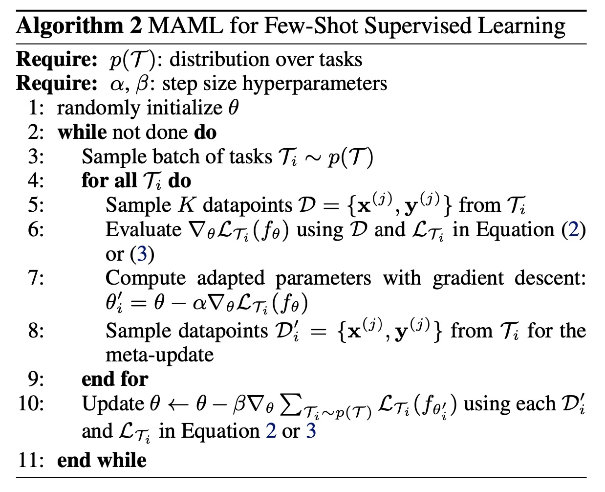
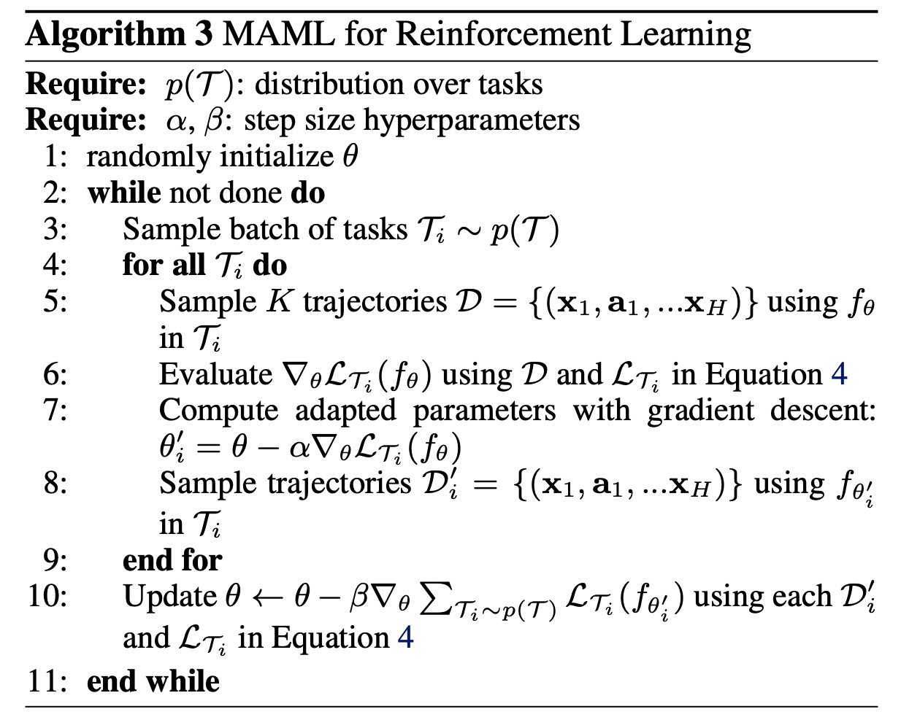
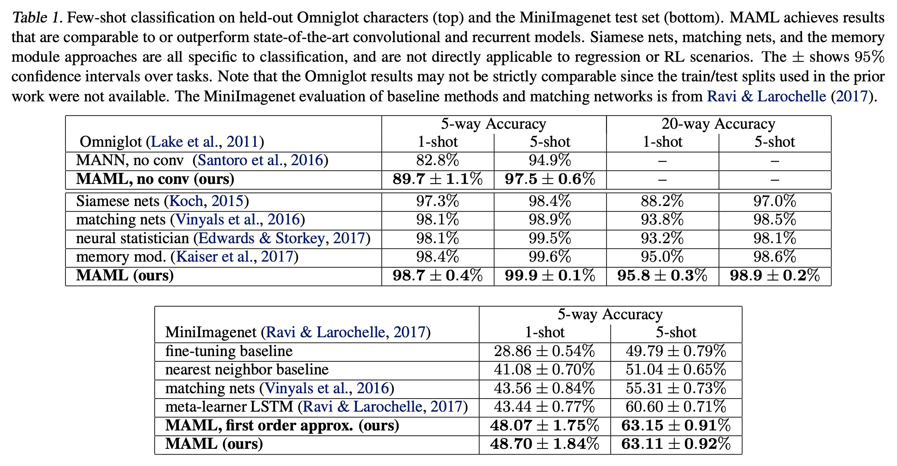

Model-Agnostic Meta-Learning for Fast Adaptation of Deep Networks

# 1. Motivation

作者提出一种与模型无关（Model-Agnostic）的元学习(Meta-Learning, MAML)方法 [1]。

元学习的目的：为了在一部分不同的task上学习一个模型，该模型在学习新的任务时，只需要一小部分的训练样本。

与模型有关的元学习会去学习[更新函数或者更新规则](https://www.jianshu.com/p/b59b32520b50)。

# 2. Model-Agnostic Meta-Learning

对于每个任务$T$，进行K-shot Learning（学习K个样本）。

元学习任务的参数是$\theta$，用梯度下降学习每个任务K-shot leaning（随机抽样K个样本）的参数$\theta'_i$。

$\theta'_i = \theta - \alpha \nabla_{\theta} L_{T_i}(f_{\theta})$

汇总所有的任务，学习元学习的参数$\theta$：让$\theta$在各个任务上的总loss最小。

$\theta = \theta - \beta \nabla_{\theta} \sum_{T_i \sim p(T)} L_{T_i}(f_{\theta'_i})$

即：元学习得到的参数$\theta$，在所有子任务上，每个子任务K-shot学习，得到的总loss最小；那么，对于一个新任务，参数初始化为$\theta$，是有很大可能学习到效果比较好的模型的。

以下是在监督学习、强化学习上的示例，本质思想相同。

# 3. Experiment

优点：

（1）感觉Google那些人站得高、想得远；idea让你看完之后不由得赞叹：真牛！我怎么就想不到这么好的idea，不能做到这么好的抽象，挖一个这么大的坑出来呢~~

 (2) 有点类似强化学习，为了让元学习参数在新任务上有较好的泛化能力，不过用了梯度下降方式来建模，可以更好地学习。

 (3) 方法与模型无关，从而可以适配不同的任务类型（回归、分类、强化学习），不同的网络结构。

思考：

 (1) 对于每个子任务，理论上应该是学到收敛为止，才是确保元学习当前的参数，最终导致了最好的效果；也就是一步（或者几个步骤）的学习是否会影响最终效果？

 (2) 目前这样的做法，要求训练任务、新的测试任务具有相同的网络结构，这样才能将元学习的参数$\theta$当做新的测试任务的初始化参数。那对于不同的网络结构或者网络结构变更，有没有更合适或者增量的元学习方式呢？

 (3) 这个搞法在工业界有没有可能使用上？应该用在什么样的场景？比如一个公司内部有多个推荐场景，可以学习一个元学习器来初始化新场景的网络？这样是不是限制了网络结构的变化，而且对于非冷启的场景，还有没有作用？

# Preferences

[1] Finn, Chelsea, Pieter Abbeel, and Sergey Levine. "Model-agnostic meta-learning for fast adaptation of deep networks." International Conference on Machine Learning. PMLR, 2017.