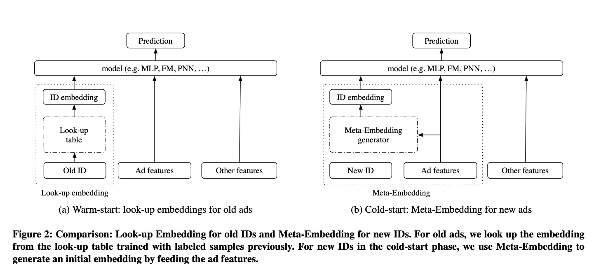
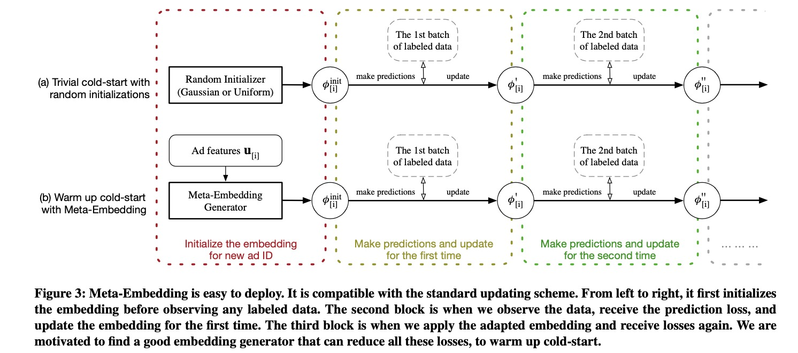
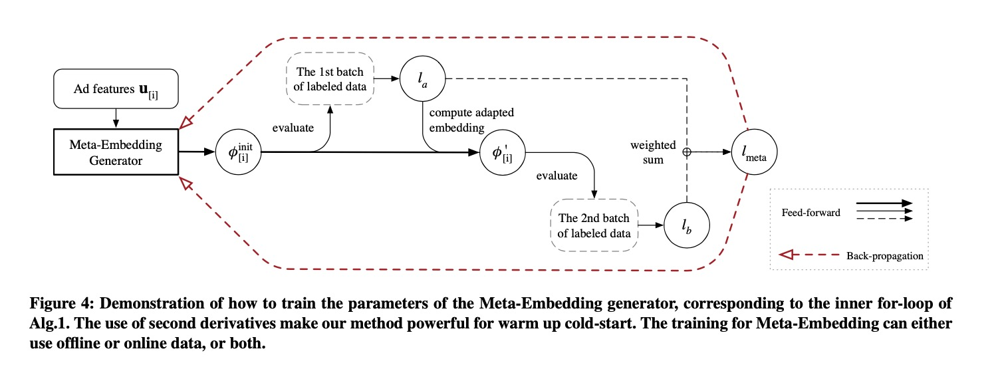
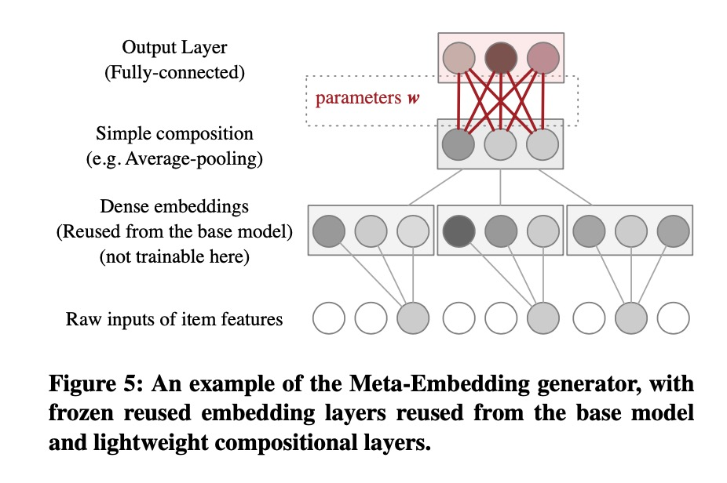
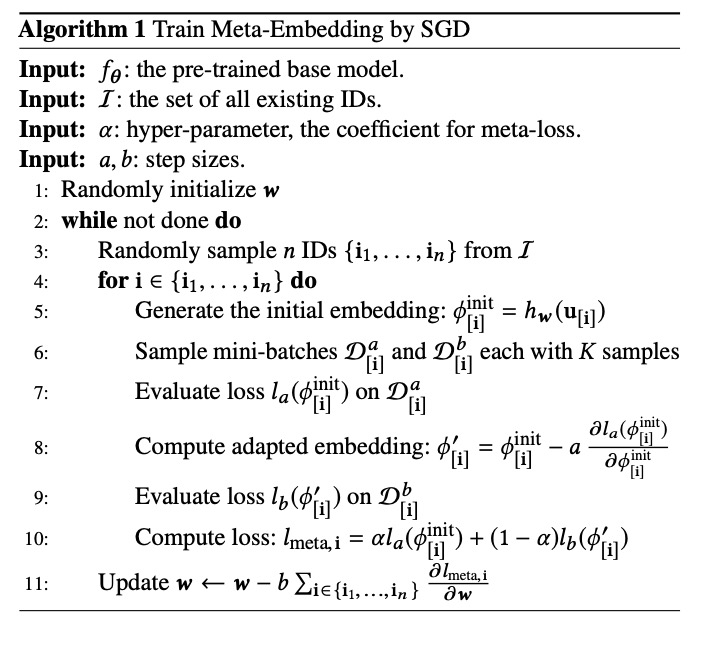
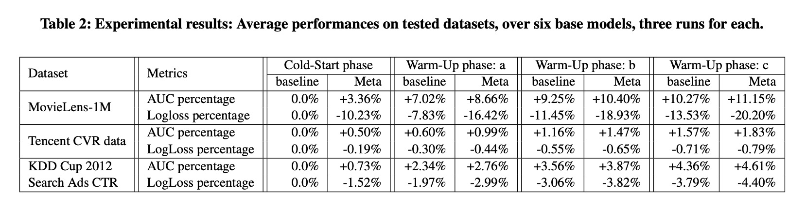

Warm Up Cold-start Advertisements: Improving CTR Predictions via Learning to Learn ID Embeddings

# 1. Motivation

在广告的点击率预估业务中，往往面临着**冷启动**问题；新的广告ID在历史日志中并没有，对于新广告ID的向量表示，一般采用随机初始化，作者注意到这样的初始化效果是不佳的。

作者采用元学习的方式，用广告ID的属性来学习ID的冷启动的向量表示。

# 2. Meta Embedding

## 2.1 Cold Start and Warm Start

本文是要提出一个'新ID的生成器'，旧的ID直接look-up embedding table，新的ID look-up embedding生成器。整体架构上是统一的，只是修改了新ID的embedding生成方式。从单纯的随机初始化，变成学习出来的初始化。可以想见，效果应该会有提升。

这一部分内容值得挖掘；因为，本文是一个很好的切入点。

## 2.2 Meta Embedding Train

整体过程借鉴了Google提出的元学习框架[MAML](https://www.jianshu.com/p/794b9936cdc4)[2]。MAML学习一个模型，使得以该模型作为参数，在一批任务上学习（一小步）总的loss最小，从而学到的模型在新任务上跟更容易学到更好的效果。

本文将每个ID的embedding学习当成一个任务，MAML每个task单独学习一个模型，从而不能直接套用MAML。

本文用一个统一的函数$h_w(u_{[i^*]})$来学习不同ID的embedding（明显不能用每个ID一个独立的模型），$\phi_{[i^*]}^{init}=h_w(u_{[i^*]})$，这个函数的输入是ID的相关属性$u_[i^*]$。

## 2.3 Meta Embedding Layer

Meta Embedding的学习函数可以用户自主设计，比如采用一个简单的DNN，输入是ID的其它的向量表示，然后接一个全连接层，输出是向量的维度，即需要生成的新ID的embedding。

需要注意的是，这里作者建议其它向量表示在这个网络里不参与学习。

## 2.4 Algorithm

# 3. Experiment

优点：

（1）基于元学习Meta Learning去学习新ID的embedding向量表示，是一个很好的切入点；新ID直接采用随机初始化，一定是一个可以深入优化的地方。

（2）对MAML做了改进，把学习新ID的embedding当成一个任务，但是同一到一个模型里去，而不是每个任务单独学习一个模型（这样就没有办法泛化了）。

（3）MetaEmbedding与原来的embedding look-up架构上是相通的，用户的上层模型可以无感知。

思考：

（1）在一些框架中，不是很好操作，尤其是在线训练的时候，需要配合维护新ID，收集一些新ID的样本来训练。

（2）用ID的静态属性当成输入，是不是特征足够了？在实际中，Meta Embedding的网络架构应该怎么设计，在复杂模型中是不是一定有效果提升？

（3）新ID怎么界定？是不是没有学好embedding的ID都可以看成新ID，怎么界定有没有学好？

# 4. Preferences

[1] Pan, Feiyang, et al. "Warm up cold-start advertisements: Improving ctr predictions via learning to learn id embeddings." Proceedings of the 42nd International ACM SIGIR Conference on Research and Development in Information Retrieval. 2019.

[2] Finn, Chelsea, Pieter Abbeel, and Sergey Levine. "Model-agnostic meta-learning for fast adaptation of deep networks." International Conference on Machine Learning. PMLR, 2017.