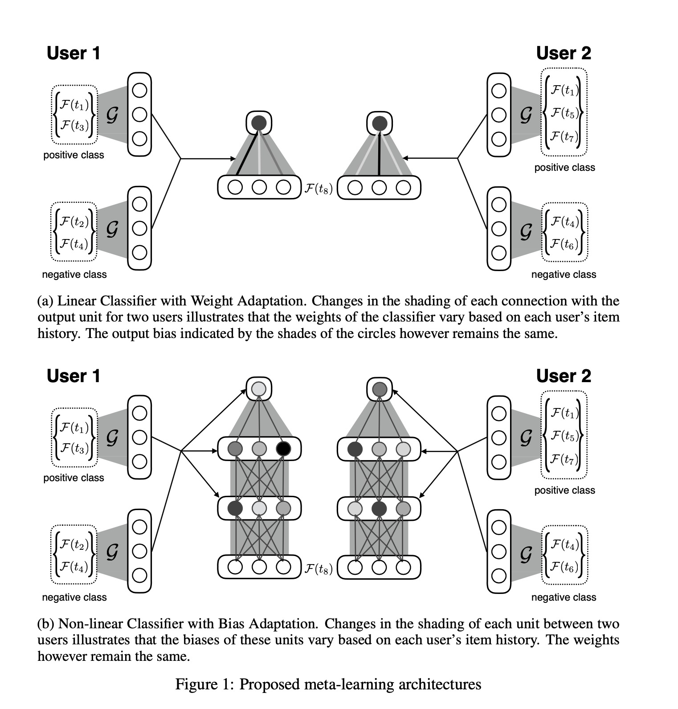
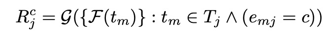
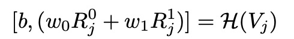
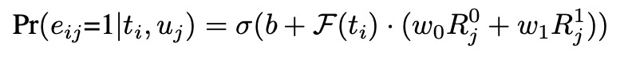
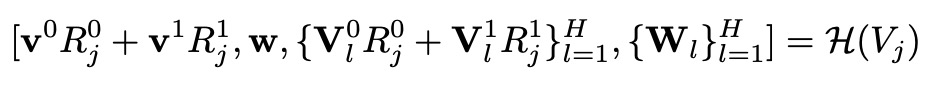
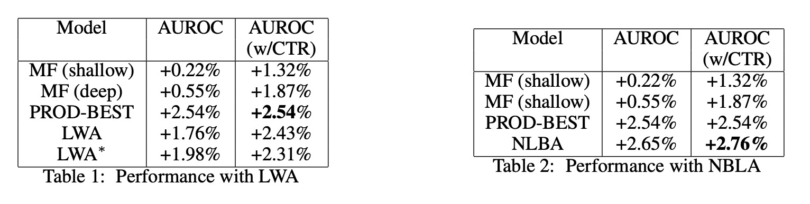

A Meta-Learning Perspective on Cold-Start Recommendations for Items

# 1. Motivation

这是2017年发表在NeurIPS上的基于元学习解决冷启动item的问题[1]；作者来自MIT、Twitter与Google Brain，但是我没有体会到特别的精彩之处，也许是我没有完全理解，也有可能是时代背景，17年用元学习解决推荐系统的冷启动问题还比较新颖。

# 2. Meta Learning Cold Start 

$e_{i,j} \in \{0, 1\}$表示user $u_j$对item $t_i$的engage，也就是喜好程度。（可能是因为实验在Twitter上做，所以item用$t$而不是$i$来表示，但是user放第二个位置用$u_j$来表示；整个符号表示实在有点别扭。）

$u_j$用TA的item历史来表示：$V_j = \{(t_m, e_{mj})\}: t_m \in T_j$。$T_j$表示已经曝光给$u_j$的item集合。

推荐系统建模为：

$Pr(e_{ij}=1|t_i, u_j) = f(t_i; H(V_j))$

$H(V_j)$以$u_j$的行为序列为输入，输出模型$f$的参数$\theta = H(V_j)$；从而这是用元学习的方式来解决冷启动问题。

本文基于元学习提出两个方法，元学习要学习一个模型，在不同的任务(task)上整体表现良好。

## 2.1 Linear Classifier with Task-dependent weights

$F(t)$表示用户的历史行为序列加上当前的item（待推荐物品）。

$R_j^c$表示不同类（正类、负类）的向量表示（对$F(t)$做聚合$G$）。

基于用户的历史行为记录来计算item分到不同类的权重。

## 2.2 Non-linear Classifier with Task-dependent bias

# 3. Experiment

优点：
（1）比较早地考虑采用元学习来建模冷启动。

思考：
（1）不是很能理解（还没有完全理解），为什么这样的算法能超越基线模型。
（2）这样的建模方式，对于复杂模型还是不是可以使用？

# 4. Preferences

[1] Vartak, M., Thiagarajan, A., Miranda, C., Bratman, J., & Larochelle, H. (2017). A meta-learning perspective on cold-start recommendations for items.