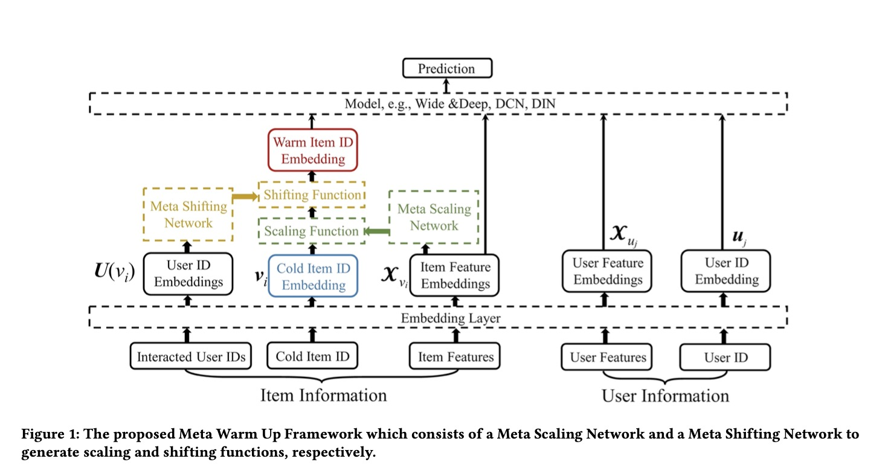
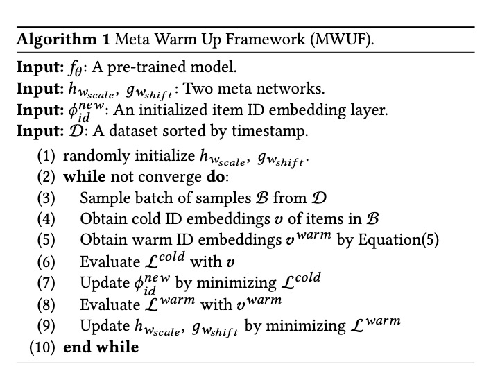
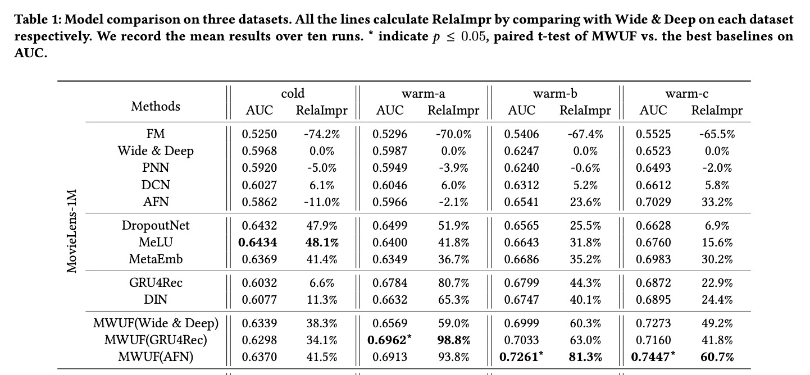

Learning to Warm Up Cold Item Embeddings for Cold-start Recommendation with Meta Scaling and Shifting Networks

# 1. Motivation

为了解决推荐系统中新item ID冷启动的embedding问题，本文一共从两个角度考虑：（1）与[MetaEmbedding](https://www.jianshu.com/p/2389165c678d)类似，学习冷启动的ID embedding；（2）解决冷启动ID的噪音交互（noisy interaction，即冷启动ID的行为数据很少，噪音比例可能很高）对embedding的影响问题。

# 2. Meta Warm Up Framework

与MetaEmbedding类似，使用Meta Network学习冷启动ID的embedding。

不同的是，本文认为warm up的embedding类似正态分布的归一化，先经过scale网络，再加上shift网络，

$v_i^{warm} = v_i \odot \tau_{v_i}^{scale} + \tau_{v_i}^{shift}$

整个计算过程，首先预训练一个base模型$f_\theta$，在warm up的embedding框架里，$f_\theta$的参数保持不变。

(1) 从全局样本$D$中随机采样部分$B$，这部分样本既包括old item（样本量比较丰富，embedding学习得比较好的item），也包括new item。

(2) 获取$B$的冷启动的ID embedding $v$，所有的item cold embedding都初始化为base模型的全局item的平均embedding。

 (3) 获取warm embedding $v^{warm}$。

 (4) 根据$v$评估$L^{cold}$。

 (5) 通过最小化$L^{cold}$更新ID embedding生成器$\phi_{id}^{new}$。

 (6) 根据$v^{warm}$评估$\phi_{id}^{new}$。

 (7) 通过最小化$L^{warm}$更新$h_{w_{scale}}$与$g_{w_{shift}}$。

# 3. Experiment

优点：
（1）不同于MetaEmbedding只用item的attribute属性来生成ID的warm up embedding，本文用到了与item有交互的User的embedding信息；一共有两个Meta Network。本质上用到的信息越多，生成的embedding应该越准。
（2）本文提到的使用item的全局平均embedding来初始化new item向量，非常直接，这就是一个均值填充，但是应该非常有效。
（3）再一次证明，区别对待冷启动ID的embedding表示与学习，非常有必要。

思考：
（1）好像并没有上线使用？没有线上实验结果。先预训练base模型，然后训练meta网络，对于一直在线训练的模型怎么使用呢？
（2）Meta Learning的形式与MetaEmbedding不一样，那这种模式的天花板在哪里？用尽所有可能的输入，用一个训练与推理可承受的最好的模型？
（3）要收集与item有交互的User的embedding，这一点对样本处理的要求很高，有没有更高效的或者近似的方法？

# 4. Preferences

[1] Zhu, Yongchun, et al. "Learning to Warm Up Cold Item Embeddings for Cold-start Recommendation with Meta Scaling and Shifting Networks." arXiv preprint arXiv:2105.04790 (2021).
