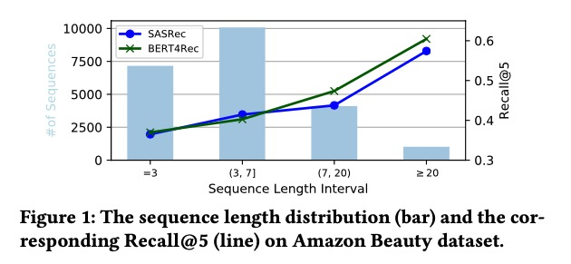
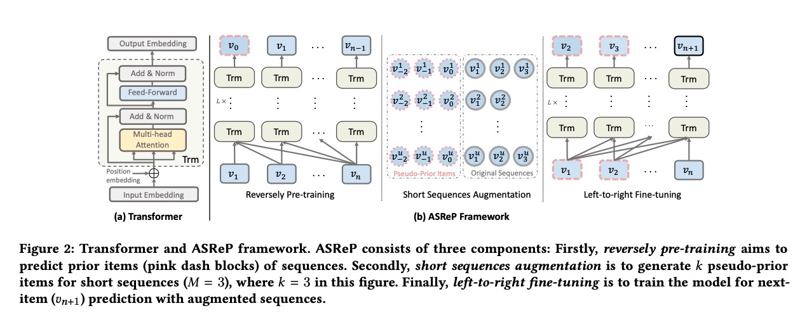
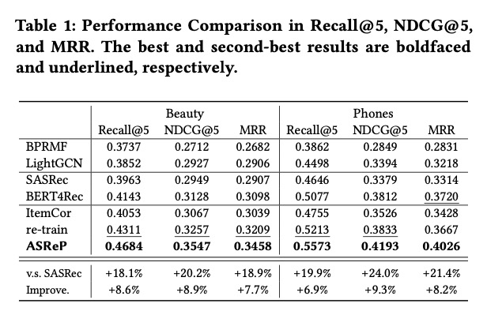

Augmenting Sequential Recommendation with Pseudo-Prior Items via Reversely Pre-training Transformer

# 1. Motivation

基于序列模型的推荐系统，关键在于建模序列内item之间的关系，如基于Transformer的模型SASRec与BERT4Rec。但是这些Transformer-based模型都面临着冷启动问题（cold-start issue），比如在很短的序列上会表现很差。

作者通过实验证实，超短序列的效果确实远差于长序列，从而决定尝试**扩充序列**。

本文提出扩充序列的推荐模型。首先pre-train一个反向序列的Transformer，用来预测每个序列的前一个item；然后基于这个Transformer在比较短的序列头部添加一些item来扩充序列；再使用扩充后的序列，fine-tune Transformer进行学习。

思路上很棒，值得尝试与延伸扩展。

# 2. AsReP

# 3. Experiment

# 4. Preferences

[1] Liu, Zhiwei, et al. "Augmenting Sequential Recommendation with Pseudo-Prior Items via Reversely Pre-training Transformer." arXiv preprint arXiv:2105.00522 (2021).