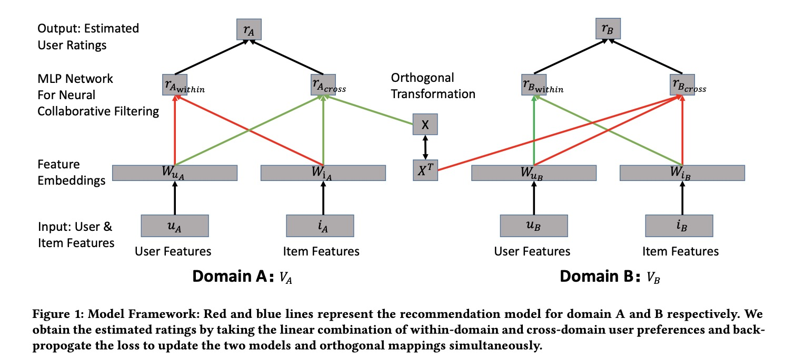
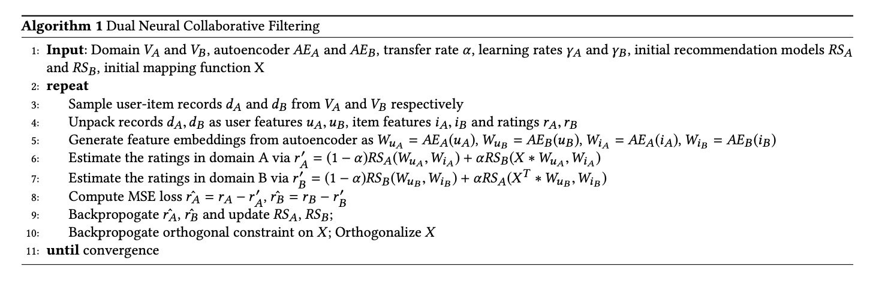
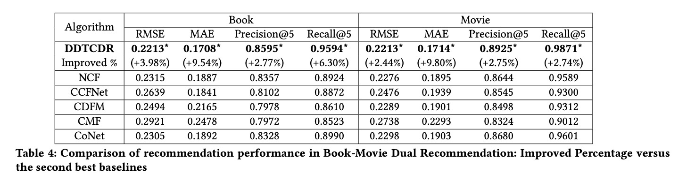

DDTCDR: Deep Dual Transfer Cross Domain Recommendation

# 1. Motivation

跨域(Cross domain)推荐是推荐系统中一个值得关注的领域。

Cross Domain有很多定义，[2]给出了相对比较正式的定义。

比如用户观看了一个电影，可以给用户推荐该电影的原著小说。这里'电影'与'小说'就是不同的域。这里跨域推荐或者迁移学习就很有意义，可以借助原域的信息提升目的域的学习效果，或者同时提升两个域的推荐效果。

跨域推荐的一个**基本假设**是，如果两个用户在一个域有相近偏好，那么这两个用户在其它域也很有可能有相近偏好。

作者指出，过往的跨域推荐没有解决：同时学习两个域的双向隐式关联（bidirectional latent relations）。

本文的主要贡献在于：

（1）使用深度双向迁移学习（deep dual transfer learning）机制来学习用户的兴趣迁移，从而同时提升两个域的推荐效果；
（2）使用跨域的隐式正交映射（latent orthogonal mapping)，来保持用户在不同域偏好的相似度，并且可以更有效地计算逆映射。

# 2. DDTCDR

对于两个域$A$与$B$，分别学习相同的向量表示。

以$A$为例，用自动编码机（AutoEncoder, AE）学习输入的用户特征与$u_A$与$i_A$的向量表示，

$W_{u_A} = AE_A(u_A)$

$W_{i_A} = AE_A(i_A)$

然后分别计算域内(within-domain)预测评分与跨域(cross-domain)预测评分：

$r'_{A_{within}} = RS_A(W_{u_A}, W_{i_A})$

$r'_{A_{cross}} = RS_B(X * W_{u_A}, W_{i_A})$

$RS_A$与$RS_B$分别是两个域的评分模型。

$X$是一个正交矩阵。

加权得到域$A$的预测评分，

$r'_A = (1-\alpha) r'_{A_{within}} + \alpha r'_{A_{cross}}$

同样的，

$r'_{B_{within}} = RS_B(W_{u_B}, W_{i_B})$

$r'_{B_{cross}} = RS_A(X^T * W_{u_B}, W_{i_B})$，这里用的是$X^T$。

对比用户在两个域的偏好，

$r'_{A_{within}} = RS_A(W_{u_A}, W_{i_A})$

$r'_{B_{cross}} = RS_A(X^T * W_{u_B}, W_{i_B})$

用户在域$A$的向量表示是$W_{u_A}$，在域$B$的向量表示是$W_{u_B}$，假设通过一个线性变换$X^T * W_{u_B}$，让两个域的用户向量对齐，则模型$RS_A$可以学出用户对于域$B$的物品$W_{i_B}$的兴趣（兴趣迁移）。

同样，用户在域$B$的向量表示是$W_{u_B}$，在域$A$的向量表示是$W_{u_A}$；基于上一步的对齐，假设$W_{u_A} = X^T * W_{u_B}$，则$W_{u_B} = (X^T)^{-1} W_{u_A} = X * W_{u_A}$。这也就是为什么$X$应该是一个正交矩阵。

比如用户在电影推荐模型$RS_A$的向量表示是$W_{u_A}$，在小说推荐模型$RS_B$的向量表示是$W_{u_B}$。将$W_{u_B}$映射到$W_{u_A}$的向量空间，就可以电影推荐模型$RS_A$来预测该用户对小说$W_{i_B}$的喜好（实际上，小说向量$W_{i_B}$也应该映射到$W_{i_A}$的向量空间？因为最后的评分是矩阵乘法，所以可能user与item都映射与只对user映射等价）。

# 3. Experiment

# 4. References

[1] Li, Pan, and Alexander Tuzhilin. "Ddtcdr: Deep dual transfer cross domain recommendation." Proceedings of the 13th International Conference on Web Search and Data Mining. 2020.

[2] Fernández-Tobías, Ignacio, et al. "Cross-domain recommender systems: A survey of the state of the art." Spanish conference on information retrieval. sn, 2012.