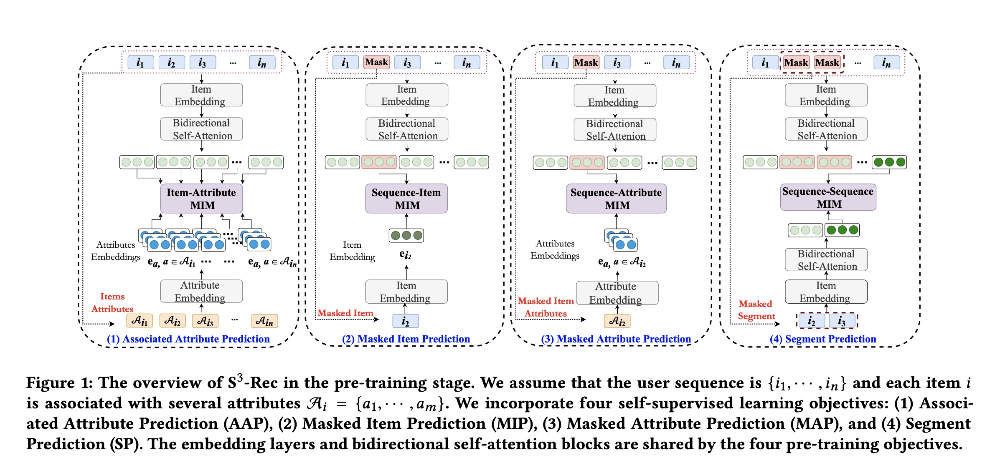
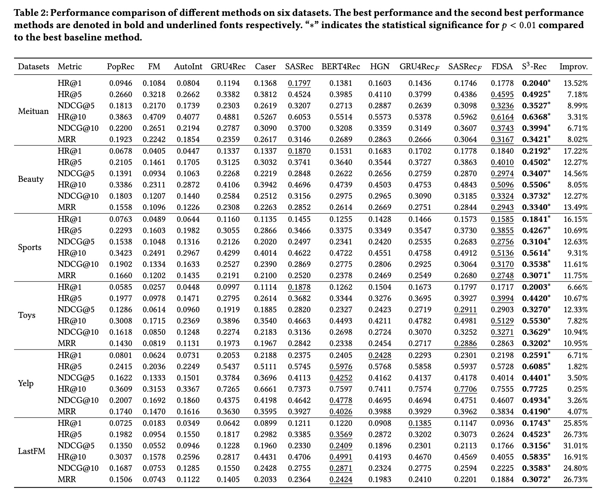

S3-Rec: Self-Supervised Learning for Sequential Recommendation with Mutual Information Maximization

# 1. Motivation

推荐系统几乎永远存在着数据稀疏问题（data sparsity problem），比如用户本身行为稀疏，用户对物品的行为存在幂律分布，长尾物品行为极其稀疏等。

背景数据(context data)与序列数据(sequence data)的关联（association）或者融合（fusion）往往被忽视了。

本文就是为了更好地使用背景数据与序列数据，提出了基于自监督学习进行序列推荐的模型S3-Rec。

# 2. S3rec

用户$u$的行为序列是$\{i_1, ..., i_n \}$，$i_{j:k}$是子序列$\{i_j, ..., i_k\}$。

每个item $i$都有一些属性$A_i = \{ a_1, ..., a_m \}$。

## 2.1 Mutual Information Maximization

给定随机变量$X$与$Y$，它们的互信息$I(X, Y)$表示知道一个随机变量，会给另外一个随机变量带来的**不确定性**的**减少**。互信息越大，两个随机变量越关联。

$I(X，Y) = H(X) - H(X|Y) = H(Y) - H(Y|X)$

直接最大化互信息是不可导，不能直接求解的。

实际中一个比较好的方式是基于InfoNCE[2]，基于Noise Contrastive Estimation[3]。

$\mathbb{E}_{p(X,Y)}[f_\theta(x,y) - \mathbb{E}_{q(\widetilde{Y})}[ \log \sum_{\widetilde{y} \in \widetilde{Y} } exp f_\theta(x, \widetilde{y}) ]] + \log |\widetilde{Y}|$

$\widetilde{Y}$ 是从分布$q(\widetilde{Y})$抽样出来的样本，包括1个正样本以及$|\widetilde{Y}| - 1$个负样本。

当$\widetilde{Y} = Y$，最大化NCE等价于最小化标准cross entropy loss。

## 2.2 S3-rec

Item的embedding矩阵是$M_I \in \mathbb{R}^{|I| \times d}$。

Attribute的embedding矩阵是$M_A \in \mathbb{R}^{|A| \times d}$。

给定长度为$n$的item序列，得到输入的embedding表示$E \in \mathbb{R}^{n \times d}$。

嵌入一个position encoding matrix $P \in \mathbb{R}^{n \times d}$。

整个序列的向量表示是$E_I = E + P$，并且每一个item都有一个属性向量表示$E_A \in \mathbb{R}^{k \times d}$，$k$是属性的个数。

模型的任务是给定输入item序列，预测用户下一个行为item的得分：

$P(i_{t+1}=i|i_{1:t}) = e_i^T F_t^L$

$e_i$是item $i$的向量表示，$F_t^L$是时间步$t$的第$L$层self-attention模块的输出。

作者给出了4个子自监督学习任务。

### 2.2.1 Modeling Item-Attribute Correlation

最大化item与属性之间的互信息，为了将有用的属性嵌入到item的表示中去。

用$e_{a_j}$表示$i$的属性$a_j$的向量表示，根据最大化互信息，

$L_{AAP}(i, A_i) = \mathbb{E}_{a_j \in A_i}[f(i, a_j) - \log \sum_{\widetilde{a} \in A / A_i } exp(f(i, \widetilde{a}))]$

$f(i, a_j) = \sigma(e_i^T W_{AAP} e_{a_j})$

### 2.2.2 Modeling Sequence-Item Correlation

类似BERT，从输入序列中随机mask掉一些item，然后根据上下文去预测这些item。

记mask掉$i_t$的序列$\{i_1, ...,mask,..., i_n\}$为$C_{i_t}$，

$L_{MIP}(C_{i_t}, i_t) = f(C_{i_t}, i_t) - \log [\sum_{\widetilde{i} \in I / \{i_t\}} f(C_{i_t}, i_t) ]$

$f(C_{i_t}, i_t) = \sigma(F_t^T W_{MIP} e_{i_t})$

$F_t$是基于双向Transformer学到的序列的第$t$个位置的向量表示。

### 2.2.3 Modeling Sequence-Attribute Correlation

随机Mask掉item的某个属性。

$L_{MAP}(C_{i_t}, A_{i_t}) = \mathbb{E}_{a \in A_{i_t}}[f(C_{i_t}, a) - \log \sum_{\widetilde{a} \in A / A_i} exp(f(C_{i_t}, \widetilde{a})) ]$

$f(C_{i_t}, a) = \sigma(F_t^T W_{MAP} e_a)$

### 2.2.4 Modeling Sequence-Segment Correlation

随机mask掉一个子序列(segment)，然后恢复。

$L_{SP}(C_{i_{j_1:j_2}}, i_{j_1:j_2}) =f(C_{i_{j_1:j_2}}, i_{j_1:j_2}) - \log \sum_{\widetilde{i}_{j_1:j_2}} exp(f(C_{i_{j_1:j_2}}, \widetilde{i}_{j_1:j_2}))$

$f(C_{i_{j_1:j_2}}, i_{j_1:j_2}) = \sigma(s^T W_{SP} \widetilde{s})$， $s$是$C_{i_{j_1:j_2}}$的向量表示，$\widetilde{s}$是$i_{j_1:j_2}$的向量表示。

## 2.4 学习过程

首先pre-train4个子模块；然后使用学习到的参数表示初始化单项transformer并从左到右进行fine-tune学习。

# 3. Experiment

# 4. Preferences

[1] Zhou, Kun, et al. "S3-rec: Self-supervised learning for sequential recommendation with mutual information maximization." Proceedings of the 29th ACM International Conference on Information & Knowledge Management. 2020.

[2] L.Kong,C.deMassond’Autume,L.Yu,W.Ling,Z.Dai,andD.Yogatama.2020.
A Mutual Information Maximization Perspective of Language Representation
Learning. In ICLR 2020.

[3] M. Gutmann and A. Hyvärinen. 2012. Noise-Contrastive Estimation of Unnor-
malized Statistical Models, with Applications to Natural Image Statistics. J. Mach.
Learn. Res. 13 (2012), 307–361.
