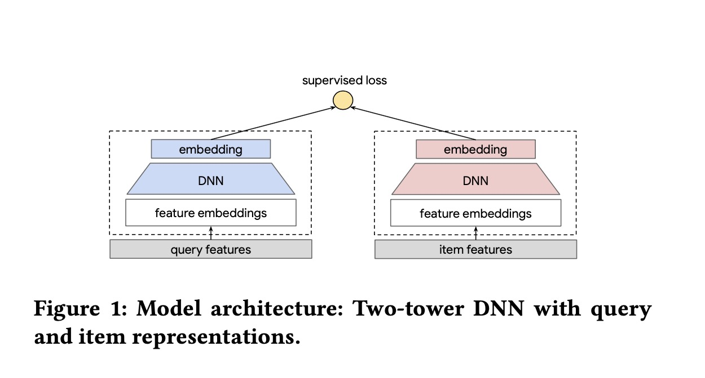
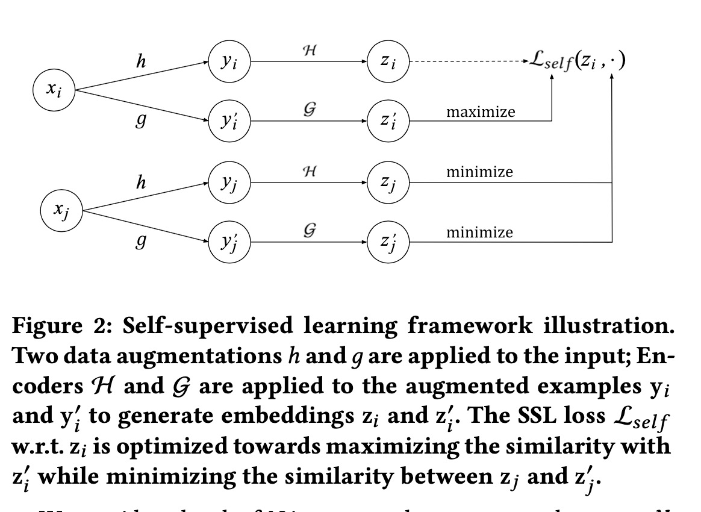
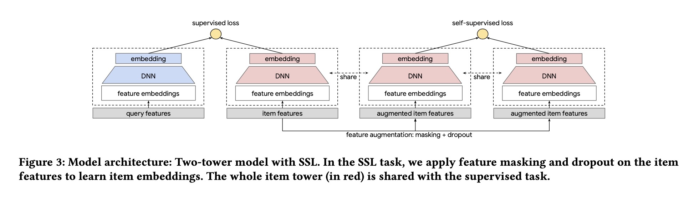
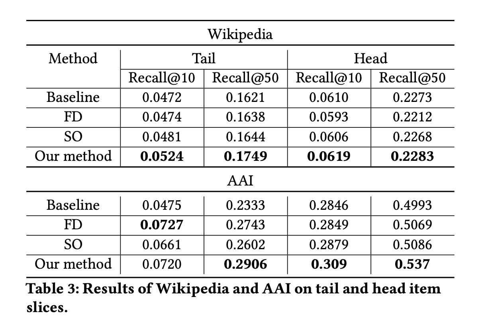

Self-supervised Learning for Large-scale Item Recommendations

# 1. Motivation

在一些item特别多的场景中，推荐系统中面临着数据过于稀疏，以及用户对item的行为呈现幂律分布，导致长尾item数据更加稀疏的情况。

鉴于自监督学习(self-supervised learning)在CV与NLP领域中的重要成果，作者考虑将这一想法应用到推荐系统中来（推荐系统一再受益于CV与NLP领域的重大成果）。

# 2. SSL

这是一个典型的双塔结构，最著名的是微软提出的DSSM模型；一般更多应用于召回环节，可以将学习到的item向量表示加载到比如Faiss这样的向量检索引擎，从而在线实时根据user向量去检索召回top N的item。

本文以这样的双塔结构为例。

典型的自监督学习结构如图2所示，使用contrastive loss, 对于一个输入$x_i$，通过数据增强等方式得到表示$y_i'$，让$y_i$与$y_i'$最终学到的表示越近越好。

对于另外一个输入$x_j$，同样经过数据增强等变换，但是让原始样本的向量表示与$x_j$的两个最终向量表示距离越远越好。

# 3. Experiment

# 4. Preferences

[1] Yao, T., Yi, X., Cheng, D. Z., Yu, F., Chen, T., Menon, A., ... & Ettinger, E. (2020). Self-supervised Learning for Large-scale Item Recommendations. arXiv preprint arXiv:2007.12865.