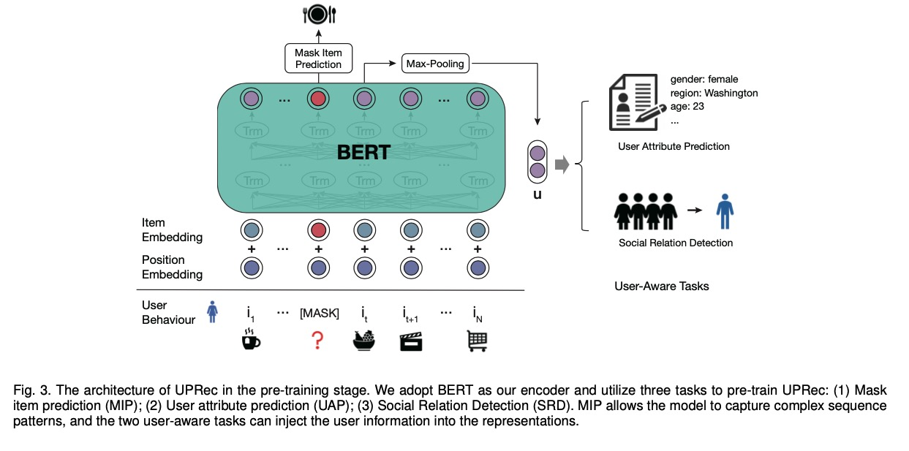
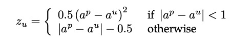
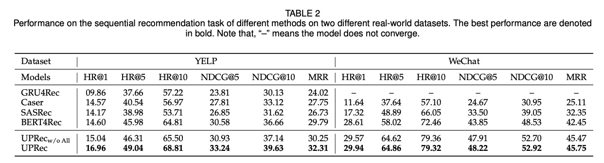

UPRec: User-Aware Pre-training for Recommender Systems

# 1. Motivation

同样为了解决基于序列模型的推荐系统面临的数据稀疏（data sparsity)问题，考虑加入个性化的多种用户信息(heterogeneous user information)，包括用户属性、结构化社交图(structured social graphs)等。

# 2. UPRec

## 2.1 Mask Item Prediction

对于用户的行为序列$\{i_1, ..., i_n\}$ 随机mask一定比例的item，

然后用BERT学习向量表示：

$H^L = BERT(\{[CLS], i_1, ..., [MASK], i_t, ..., i_n, [SEP] \})$

[CLS]与[SEP]是表示序列开始与结束的特殊标记。

损失函数：

$L_{MIP} = - \frac{1}{|S_M|} \sum_{j \in S_M} -log P(i_j^p = i_j)$

$S_M$是被mask的item的位置集合，$i_j^p$与$i_j$分别表示位置$j$的预测item与原始item。

测试：将[MASK]标记放在序列结尾，让模型预测[MASK]代表的item。

## 2.2 User Attribute Prediction

作者认为，用户的行为会反应用户属性；因此基于用户行为去预测用户属性。

首先基于BERT得到用户的行为向量表示，

$u = MaxPooling(H^L)$

对于numerical attributes，例如年龄、平均评分等，当成回归问题，采用Huber loss, 

$L_r = \frac{1}{|U|} \sum_{u \in U} z_u$

$a^p$与$a^u$分别表示预测值与属性的groud truth。

对于discrete attributes，例如性别、区域，当成分类问题。

$L_c= \frac{1}{U} \sum_{u \in U} - \log P(a^p = a^u)$

整体损失，

$L_{UAP} = \sum_{a \in A_n}L_r + \sum_{a \in A_d} L_c$

## 2.3 Social Relation Detection

给定训练数据$\{u_q, u_c^+, u_{c,1}^-, ..., u_{c,m}^- \}$，$u_q$表示query user, $u_c^+$表示query user的朋友，$u_{c,i}^-$表示负样本。

两个user的相似度表示为，

$sim(u_q, u_c)= -[w_s^T (u_q-u_c)^2 + b_s]$

损失函数：

$L_{SRD} = - \log \frac{e^{sim(u_q, u_c^+)}}
{e^{sim(u_q, u_c^+)} + \sum_{j=1}^m e^{sim(u_q, u_{c,j}^-)}}$

这里**负样本选择**非常重要。

作者提出：

1. 采用in-batch negative strategy。一个batch里user的正样本可以做为其它user的负样本。

2. 鉴于二阶好友以及相似profile的用户将来很有可能成为好友，作者将这种情况从负样本中剔除出去。

## 2.4 Training

损失函数，

$L = \lambda_1 L_{MIP} + \lambda_2 L_{UAP} + \lambda_3 L_{SRD}$

Fine-tune，对于sequential recommendation任务，mask每个序列的最后一个item并预测，然后采用负log似然来优化模型。

对于user profile prediction任务，使用[CLS]的hidden向量代表user。

# 3. Experiment

# 4. Preferences

[1] Xiao, Chaojun, et al. "UPRec: User-Aware Pre-training for Recommender Systems." arXiv preprint arXiv:2102.10989 (2021).