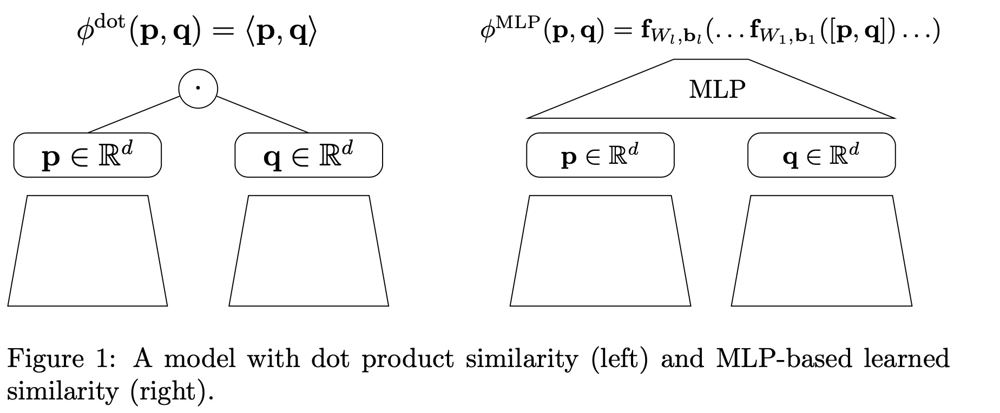
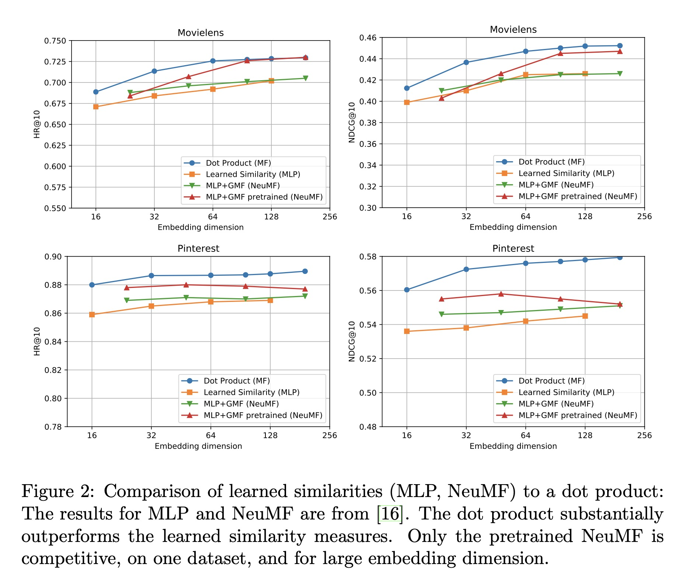
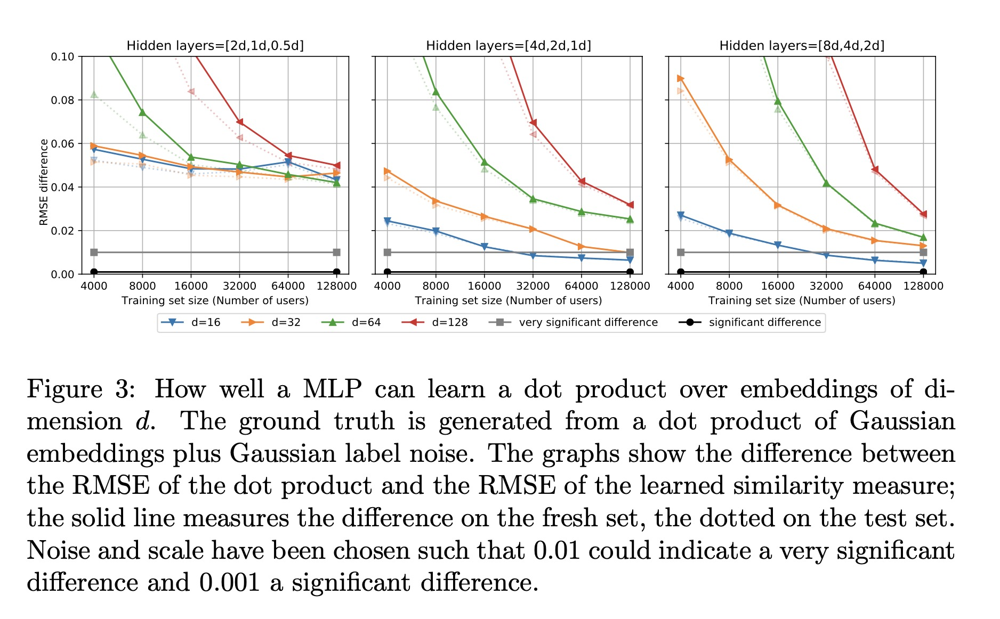

Neural Collaborative Filtering vs. Matrix Factorization Revisited

# 1. Motivation

这是一篇引起轰动的论文，motivation就是NCF[2]在推荐系统的引用量太高了(2427+)，作者通过实验与分析，说明**dot product在推荐系统的计算相似度任务里效果比MLP更好**，大家别被带偏了。

# 2. Dot Product vs MLP

Dot Product就是矩阵分解，

$\phi^{dot}(p, q) := b + p_1 + q_1 + <p_{[2, ..., d]}, q_{[2, ..., d]}>$；
$p$与$q$可以理解成user与item的embedding。

MLP是用神经网络计算，先随机初始化user与item的embedding，然后concat起来经过DNN学习得到偏好得分，

$\phi^{MLP}(p, q) := f_{W_l, b_l}(... f_{W_1, b_1}([p, q])...)$

GMF是[2]提出的$p$与$q$的element-wise的加权Dot product，是矩阵分解的泛化版本。

$\phi^{GMF}(p, q) := \sigma(w^T(p \odot q)) = \sigma \left( \sum_{f=1}^d w_f p_f q_f\right)$

$\phi^{NeuMF}(p, q) := \phi^{MLP}(p_{[1,...,j]}, q_{[1,...,j]}) + \phi^{GMF}(p[j+1...d], q[j+1...d])$

NeuMF把embedding的一部分用来做MLP，一部分用来做GMF。

作者经过试验证明，经过调参的Dot product效果远好于MLP以及NCF提出的NeuMF(MLP+GMF)。

作者分析了，GMF引入了权重参数$w$，如果L2正则化不加上$W$，实际上学习没有任何效果；引入更多的参数，实际上需要更多数据来学习。

# 3. Learning a Dot Product with MLP is Hard

作者构造了一些Dot Prodcut的数据，用MLP去学习。

从实验结果中可以看出，MLP的学习误差非常大，RMSE大于0.02；说明如果问题的归纳偏置（induction bias，即问题的假设）是Dot Product的，MLP是不能很好地学习出来的。

作者举了几个例子，虽然MLP是万能模拟器，但是在很多领域是不能取代特定的归纳偏置的，比如CNN里的卷积、池化；RNN的参数共享；transformer结构等。在推荐系统里，可能归纳偏置就是Dot Product。 也可以看出，大部分情况下是从MLP往特定结构走，而不是往回走（再搞一个大新闻）。

思考：
（1）看论文不可尽信，要有自己的思考，更要动手去实践。
（2）不要总想搞一个大新闻，要多思考问题的本质。

# 4. Preferences

[1] Rendle, Steffen, et al. "Neural collaborative filtering vs. matrix factorization revisited." Fourteenth ACM Conference on Recommender Systems. 2020.

[2] He, X., Liao, L., Zhang, H., Nie, L., Hu, X., and Chua, T.-S. Neural collaborative filtering. In Proceedings of the 26th International Conference on World Wide Web (Republic and Canton of Geneva, Switzerland, 2017), WWW ’17, International World Wide Web Conferences Steering Commit- tee, pp. 173–182.
