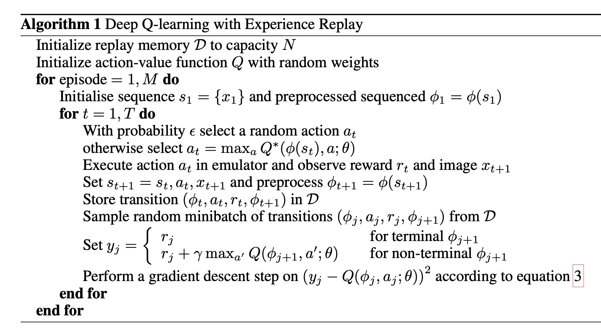
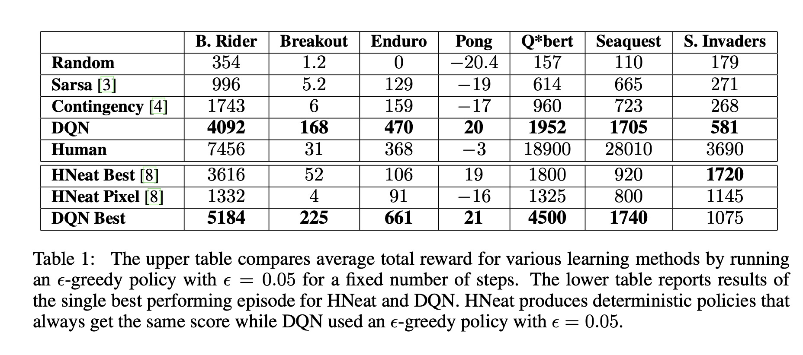

Playing atari with deep reinforcement learning

# 1. Motivations

在2013年，卷积神经网络CNN已经开始展现巨大的威力，**启发**了作者（从事强化学习领域多年的专家），将CNN应用到强化学习上来，端到端地进行强化学习，应用到打游戏(Atari)上。

# 2. DQN

现在看起来，DQN其实很好理解，从Q-leanring[2]发展过来，使用DNN来学习Q函数，即Q网络。

应用了经验回放（Experience Replay)[3]机制，用一个存储空间$D$来存储最近$N$次的记录$(\phi_t, a_t, r_t, \phi_{t+1})$，$\phi$是状态$s$的函数。

DQN是一个model-free的模型，不去显式地建模环境(Environment)，只是基于采样来与环境交互。

DQN是一个off-policy模型，每一次根据$\epsilon$-greedy策略来贪心选择action。

# 3. Experiment

作者表示在模拟游戏环境中取得了比其他强化学习算法以及人类顶级游戏玩家的优胜。

DQN启迪了后续的深度强化学习研究。

# 4. Preferences 

[1] Mnih, Volodymyr, et al. "Playing atari with deep reinforcement learning." arXiv preprint arXiv:1312.5602 (2013).

[2] Christopher JCH Watkins and Peter Dayan. Q-learning. Machine learning, 8(3-4):279–292, 1992.

[3] Long-Ji Lin. Reinforcement learning for robots using neural networks. Technical report, DTIC Document, 1993.