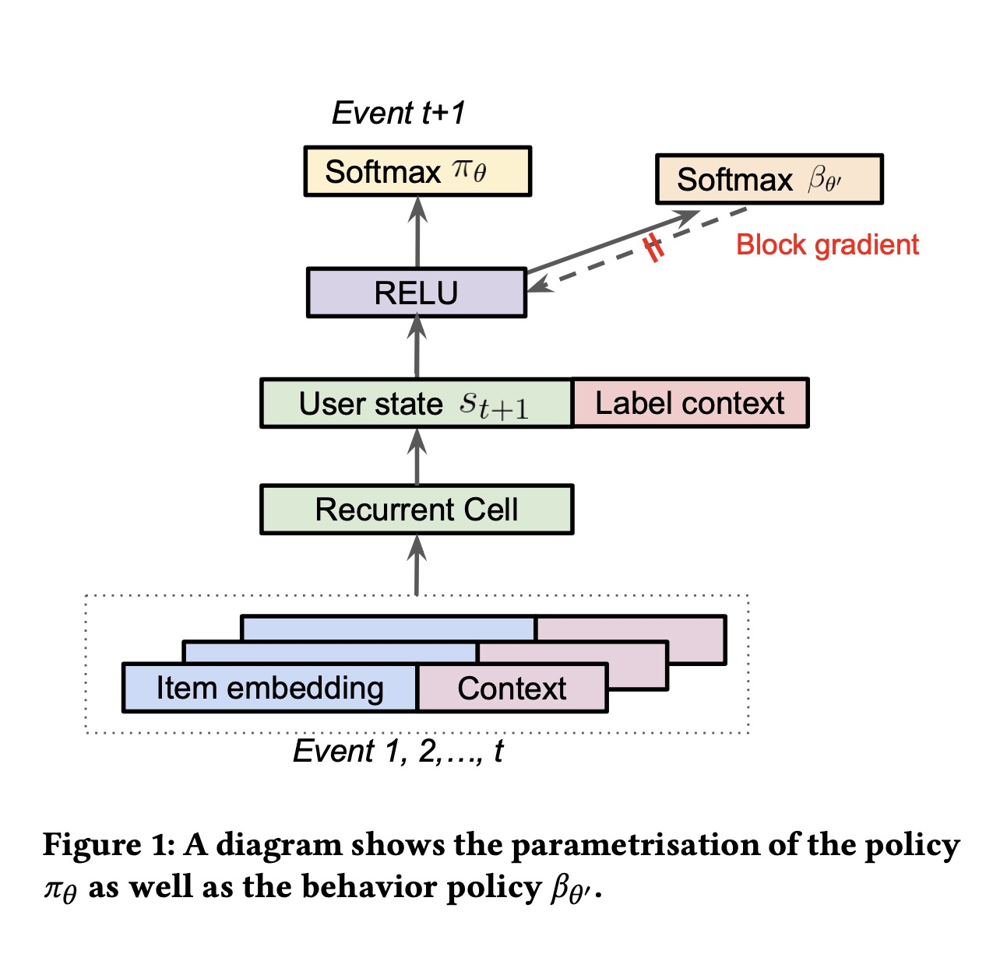
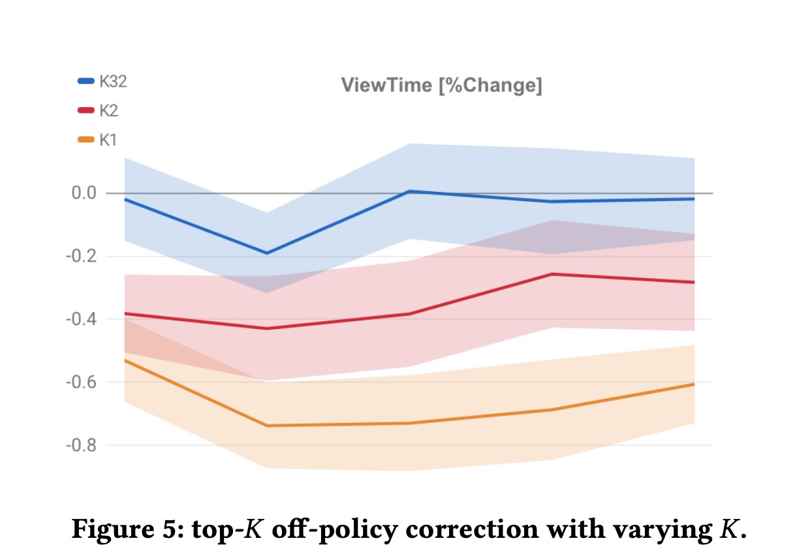

Top-𝐾 Off-Policy Correction for a REINFORCE Recommender System

# 1. Motivations

作者总结了他们的贡献：
（1）将REINFORCE方法scale到工业界，可以用于大规模action；
（2）使用off-policy方法来解决数据的bias(指仅根据用户过往的行为日志学习是有偏的)；
（3）提出top-K off-policy方法，一次性选择多个action，因为在推荐系统中需要一次推荐多个item；
（4）证明exploration的价值。

# 2. REINFORCE Recommender

# 3. Experiment

# 4. References
[1] Chen, Minmin, et al. "Top-k off-policy correction for a REINFORCE recommender system." Proceedings of the Twelfth ACM International Conference on Web Search and Data Mining. 2019.